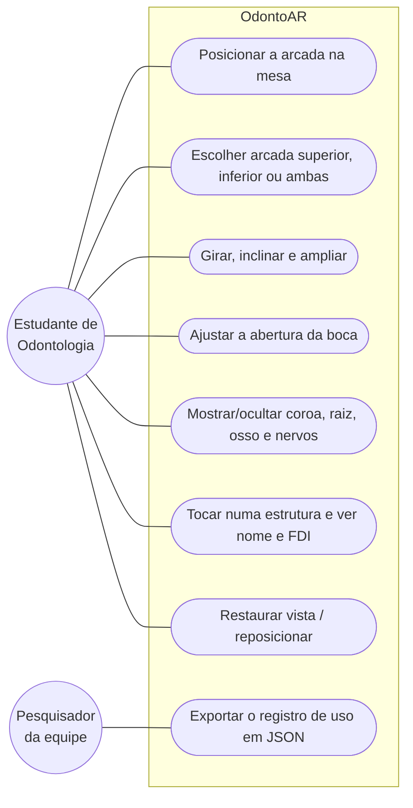

# Casos de uso

```mermaid
flowchart LR
    Aluno((Estudante de<br/>Odontologia))
    Pesq((Pesquisador<br/>da equipe))

    subgraph OdontoAR
        UC1([Posicionar a arcada na mesa])
        UC2([Escolher arcada superior, inferior ou ambas])
        UC3([Girar, inclinar e ampliar])
        UC4([Ajustar a abertura da boca])
        UC5([Mostrar/ocultar coroa, raiz, osso e nervos])
        UC6([Tocar numa estrutura e ver nome e FDI])
        UC7([Restaurar vista / reposicionar])
        UC8([Exportar o registro de uso em JSON])
    end

    Aluno --- UC1 & UC2 & UC3 & UC4 & UC5 & UC6 & UC7
    Pesq --- UC8
```
