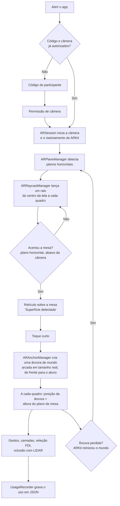

# Fluxo da Realidade Aumentada

```mermaid
flowchart TD
    A[Abrir o app] --> B{Código e câmera<br/>já autorizados?}
    B -- Não --> C[Código do participante] --> D[Permissão de câmera]
    D --> E
    B -- Sim --> E[ARSession inicia a câmera<br/>e o rastreamento do ARKit]
    E --> F[ARPlaneManager detecta<br/>planos horizontais]
    F --> G[ARRaycastManager lança um raio<br/>do centro da tela a cada quadro]
    G --> H{Acertou a mesa?<br/>plano horizontal, abaixo da câmera}
    H -- Não --> G
    H -- Sim --> I[Retículo sobre a mesa<br/>'Superfície detectada']
    I --> J[Toque curto]
    J --> K[ARAnchorManager cria uma âncora de mundo<br/>arcada em tamanho real, de frente para o aluno]
    K --> L[A cada quadro: posição da âncora +<br/>altura do plano da mesa]
    L --> M[Gestos, camadas, seleção FDI,<br/>oclusão com LiDAR]
    L --> N{Âncora perdida?<br/>ARKit reiniciou o mundo}
    N -- Sim --> F
    M --> O[UsageRecorder grava o uso em JSON]
```
