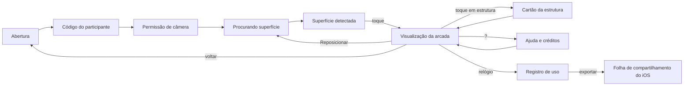

# Fluxo de navegação

```mermaid
flowchart LR
    A[Abertura] --> B[Código do participante]
    B --> C[Permissão de câmera]
    C --> D[Procurando superfície]
    D --> E[Superfície detectada]
    E -- toque --> F[Visualização da arcada]
    F -- toque em estrutura --> G[Cartão da estrutura]
    G --> F
    F -- "?" --> H[Ajuda e créditos]
    H --> F
    F -- relógio --> I[Registro de uso]
    I -- exportar --> J[Folha de compartilhamento do iOS]
    F -- Reposicionar --> D
    F -- voltar --> A
```

Na segunda abertura, com código e câmera já salvos, o app vai direto para "Procurando superfície".
